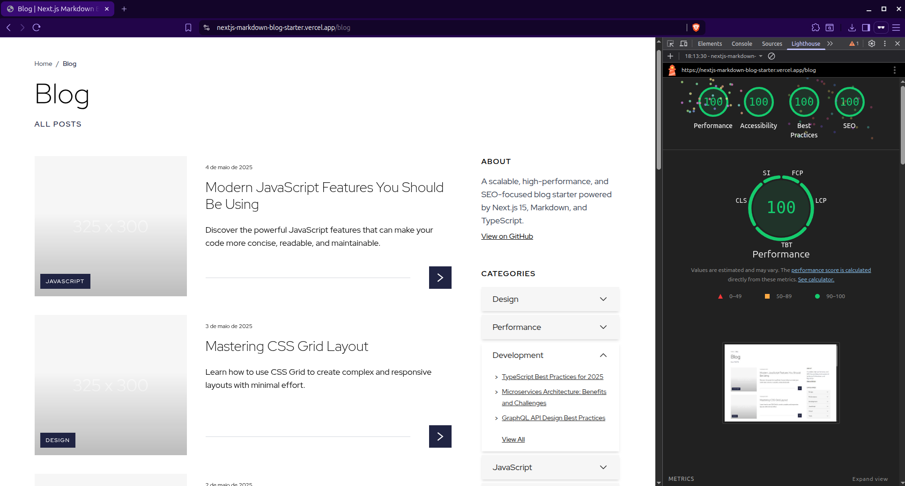

# nextjs-markdown-blog-starter

A scalable, high-performance, and SEO-focused blog starter powered by Next.js 15, Markdown, and TypeScript — designed collaboratively with AI (Claude 3.7 Sonnet) to explore intelligent architecture planning and progressively refined into a modern UI experience.



---

## About the project

A boilerplate for building modern blogs with a static generation strategy (SSG) using Next.js 15, Markdown, and TypeScript.

Originally minimal, the project now includes an optional Modern UI branch with redesigned components and extra UI utilities — while keeping the core lightweight, modular, and production-ready.

---

## AI-driven architecture

The initial prompt used to shape the project before later refinements and the Modern UI redesign — is available in [`initial-prompt.md`](./initial-prompt.md).

Key decisions supported by AI:
- Blog architecture and folder structure
- Separation of data, rendering, and SEO concerns
- Scalable and modular design principles

---

## Technologies used

**Core Stack:**
- [Next.js 15](https://nextjs.org/)
- App Router
- Markdown (`.md`)
- TypeScript
- `gray-matter` (frontmatter parsing)
- `remark` / `remark-html`

**Styling:**
- [Tailwind CSS](https://tailwindcss.com/)
- `@tailwindcss/typography`
- SCSS (Sass)

**UI (Modern UI branch):**
- **Swiper** — used only in the Related Posts component.
- **MUI + Emotion** — used only for a custom dropdown component.
- Both are optional and can be removed easily if you prefer a custom UI.

**Others:**
- Dynamic SEO with `generateMetadata`
- Modular TypeScript structure
- Docker and Docker Compose (optional)

---

## Getting started

This is a [Next.js](https://nextjs.org) project bootstrapped with [`create-next-app`](https://nextjs.org/docs/app/api-reference/cli/create-next-app).

### Using Node.js

```bash
git clone https://github.com/victornns/nextjs-markdown-blog-starter
cd nextjs-markdown-blog-starter
npm install
npm run dev
```

Open [http://localhost:3000](http://localhost:3000) in your browser.

---

## Minimal setup (branch: `feat/minimal-setup`)

If you're looking for a lightweight base with only the essential files — without Docker, UI extras, or config templates — check out the [`feat/minimal-setup`](https://github.com/victornns/nextjs-markdown-blog-starter/tree/feat/minimal-setup) branch.

Ideal for kickstarting your own custom blog structure.

---

## Project structure (summary)

```
/src/app/blog/
├── page.tsx                  // main blog list
├── [category]/               // category routes
│   ├── page.tsx
│   └── [slug]/page.tsx       // individual post pages
├── components/               // UI components
├── data/
│   ├── posts/                // markdown files
│   └── categories.json       // category metadata
├── lib/                      // utility functions
├── types/                    // TypeScript types
```

---

## License

This project is licensed under the [MIT License](./LICENSE).  
Distributed under the MIT License. See `LICENSE` for more information.